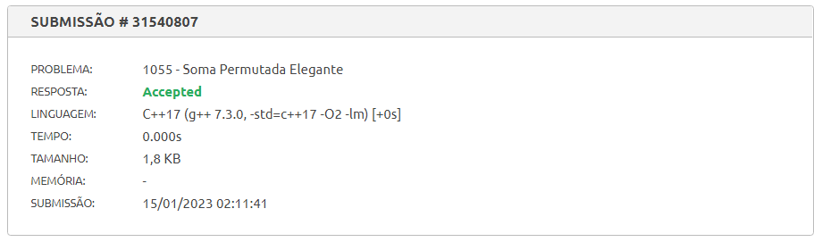

Tema:
 - Greed

# Resolução de exercicios

**Número da Lista**: 4 
**Conteúdo da Disciplina**: Greed 

## Alunos
|Matrícula | Aluno |
| -- | -- |
| 170032591  |  Edvan Barreira Gomes Junior |
| 170020525  |  Pedro Henrique de Lima Malaquias |

## Sobre 
Aqui serão postadas algumas resoluções de exercicios referentes ao tema de Greed. 

## <b>Exercícios:</b>

### <b>Exercício 1: (beecrowd 1055) Soma Permutada Elegante</b>
- Clique [<b>aqui</b>](https://www.beecrowd.com.br/judge/pt/problems/view/1055) para ver o exercício.
- Screenshot da submissão: 

### <b>Exercício 2:</b>
- _Link_: 
- Screenshot da submissão: 
